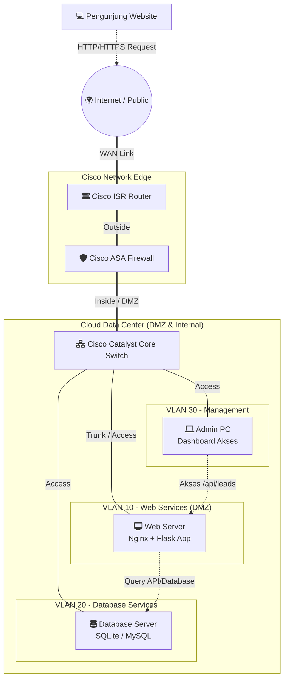

# Topologi Jaringan Cisco (Cloud Computing Hosting)

Karena ini merupakan bagian dari tugas *Cloud Computing*, berikut adalah rancangan **Topologi Jaringan Enterprise (Cisco)** yang menggambarkan infrastruktur bagaimana *Landing Page Media Journey* dan *Backend Flask* ini akan di-hosting di *Data Center* atau penyedia layanan *Cloud*.

### Penjelasan Perangkat Cisco & Perannya:
1. **Cisco ISR Router (Edge Router):**
   Menerima lalu lintas jaringan (traffic) dari internet/publik menuju ke alamat IP Public dari server Cloud tempat website Media Journey berada.
2. **Cisco ASA Firewall:**
   Menyaring lalu lintas jaringan (Packet Filtering). Firewall ini bertugas menahan serangan seperti *DDoS* dan memblokir port yang tidak perlu, serta hanya membuka Port 80 (HTTP) dan 443 (HTTPS) untuk masuk ke Web Server.
3. **Cisco Catalyst Core Switch:**
   Berfungsi untuk membagi jaringan ke dalam beberapa VLAN demi alasan keamanan.
4. **VLAN 10 (Web Server - DMZ):**
   Zona tempat *Flask Backend* (`app.py`) dan *Landing Page* (`media_journey_landing.html`) berjalan. Zona ini bisa diakses dari internet.
5. **VLAN 20 (Database Server):**
   Tempat penyimpanan `leads.db`. Disembunyikan di VLAN terpisah yang **tidak memiliki akses langsung dari internet**. Hanya Web Server (VLAN 10) yang diizinkan berkomunikasi ke VLAN 20.
6. **VLAN 30 (Management):**
   Jalur khusus untuk Administrator (Anda) guna mengakses `admin.html` dengan aman tanpa melalui rute publik.
